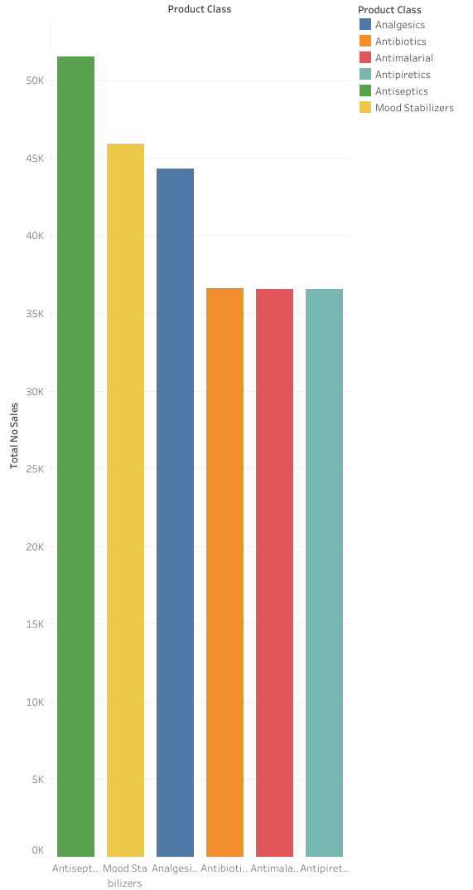
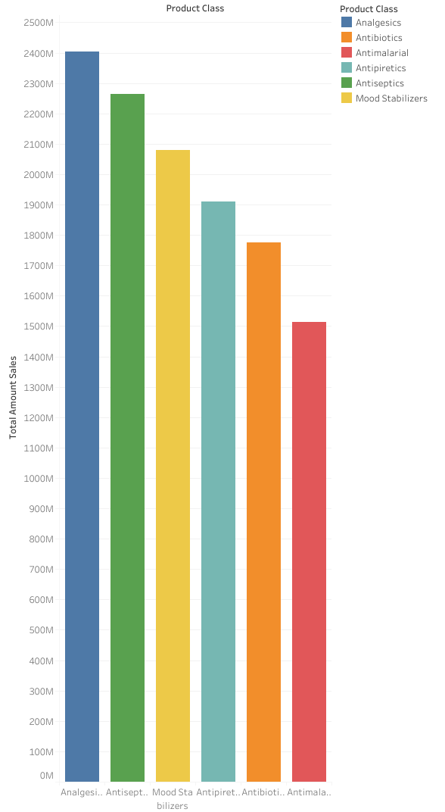
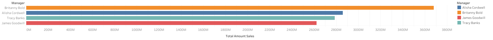
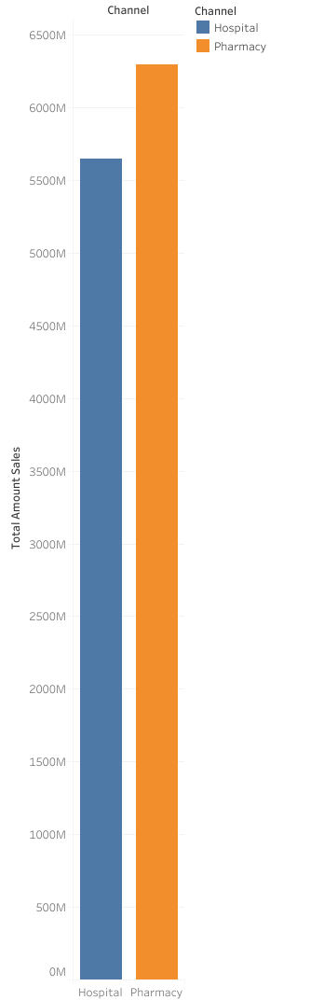
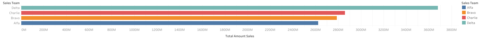
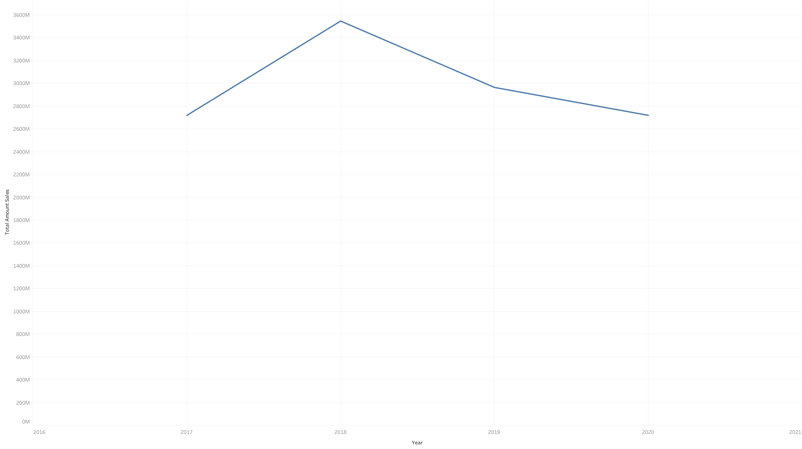
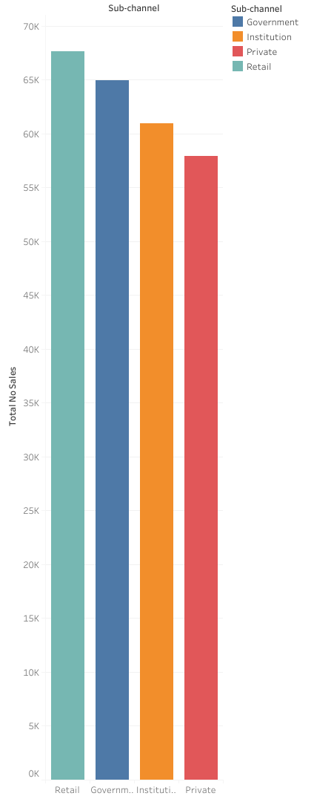
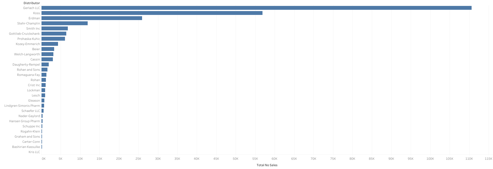

# FORESIGHT PHARMACEUTICAL CASE STUDY

Foresight Pharmaceuticals is one of the leading Pharmaceutical Manufacturing companies with a global presence.
Their Markets are divided into different regions across the world. One of those regions manages the German and Poland Markets.
However the company does not sell directly to customers. Instead, they work with a couple of Distributors in all their regions.
They have an agreement with each of the distributors to share their Sales Data with them. This is to enable them to gain insights up to the retail level.

 

## BUSINESS QUESTION FOR THIS CASE STUDY

As a Data Analyst working on this case study, I have decided to put forward the following business question, and provide my answer to it using my data analytics skills, as well as provide reasonable and actionable business recommendations to Foresight Pharmaceutical Company:

**How is the sales performance for distributors, and how can this be improved to increase revenue?**

 

## DATA PREPARATION (DESCRIPTION OF THE DATASET)

The dataset for Foresight Pharmaceuticals Company was obtained from [here.](https://foresightbi.com.ng/practice-data/3-datasets-for-your-portfolio/)
The dataset was provided by Ahmed Oyelowo, under the GPL license.
The following is a description of the dataset:

|Field|Description|
|:----|:----|
|Distributor|Name of Wholesaler|
|Customer Name|Name of customer|
|City|Customer's city|
|Country|Customer's country|
|Latitude|Customer's Geo Latitude|
|Longitude|Customer's Geo Longitude|
|Channel|Class of buyer (Hospital, Pharmacy)|
|Sub-channel|Sector of buyer (Government, Private etc)|
|Product Name|Name of Drug|
|Product Class|Class of Drug (Antibiotics, etc)|
|Quantity|Quantity purchased|
|Price|Price product was sold for|
|Sales|Amount made from sale|
|Month|Month sale was made|
|Year|Year sale was made|
|Name of Sales Rep|Name of Sales rep who facilitated the sale|
|Manager|Sales rep's Manager Name|
|Sales Team|Sale rep's team|

The dataset was provided as an Excel spreadsheet (XLSX) of eighteen fields/columns and 254,082 records/rows.

 

## DATA PROCESSING (CLEANING OF THE DATASET)

Data filtering was done using Google Sheets. The following information was discovered during the filtering process: 

1)	There are 29 distributors for this company 
2)	There are two countries, Germany & Poland 
3)	Geolocation is between latitude 54.7819 and 47.5142, while longitude is between 23.5667 and 6.0838.
4)	There are two channels of distribution. Pharmacy, and Hospital.
5)	There are four sub-channels. Government, Institution, Private, and Retail.
6)	There are six product classes. Analgesics, Antibiotics, Antimalarial, Antipyretics, Antiseptics, and Mood stabilizers.
7)	During data cleaning, I found 2633 rows having negative data in the ‘Quantity’ field. This is inconsistent and I have to delete them. It is inconsequential because it accounts for just 1.04% of the original data set. 
8)	It is observed that the data was for the years 2017, 2018, 2019, and 2020.
9)	There are four managers and thirteen sales reps.
10)	There are four team members.

 

## DATA ANALYSIS (INSIGHTS FROM THE DATASET)

I ran some queries on the dataset using Microsoft SQL Server to carry out my analysis toward answering the business question. The results of these queries were then visualized graphically using Tableau software.

The following are important insights revealed by my analysis on the dataset:

1.	From the total quantity per product class visualization: it was observed that the top three performing product classes are Analgesics, Antiseptics, and mood stabilizers. See also the total amount of sales per product class.

 |  |  |
 |:-----------:|:------------:|
 ||

 
2.	The total amount of sales per manager: it is observed that Britany Bold is the highest-performing manager. Alisha Coldwell is also performing reasonably in terms of revenue.

 
3.	The total amount of sales per channel: Pharmacies slightly ordered the product more than hospitals. 

 
4.	The total amount of sales per sales team: the delta team has the highest. Charlie’s team is also doing well in terms of amount of sales.

 
5.	The total amount of sales per year: the year 2018 has the highest total sales in four years period, with sales gradually decreasing. Up until 2020, the company needs to put more effort into marketing and sales. 
 

 
6.	The number of sales per sub-channel: retail and Government have the highest number of sales. 

 
 
7.	The total number of sales per distributor: the top four distributors are Gerlach LLC, Koss, Erdman, and Stehr-Champlin. However, the amount of sales per distributor shows that instead of Stehr-Champlin, it is actually Kozey-Emmerich that comes in the fourth place.

 

**For details of the SQL queries, [click here](../code/analysis.sql) to see the “analysis.sql” file.**

## DATA ACTION (RECOMMENDATIONS FROM THE INSIGHTS)

The following are my best business recommendations based on the insights revealed by the Foresight Pharmaceutical Company data:

1)	Foresight Pharmaceutical should focus more on the production and marketing of Analgesics, Antiseptics, and mood stabilizers in order to maximize revenue. 
2)	Since overall sales are dropping in recent years, the company needs to do more in terms of marketing strategy to revive sales.
3)	The company needs to focus more on working with top-performing distributors such as Gerlach LLC, Koss, Erdman, and Kozey Emmerich as well as improve business relations with the other low-performing distributors 
4)	The company might need to reward the top-performing managers/sales team, as well as encourage the low-performing managers/sales team to do more.
